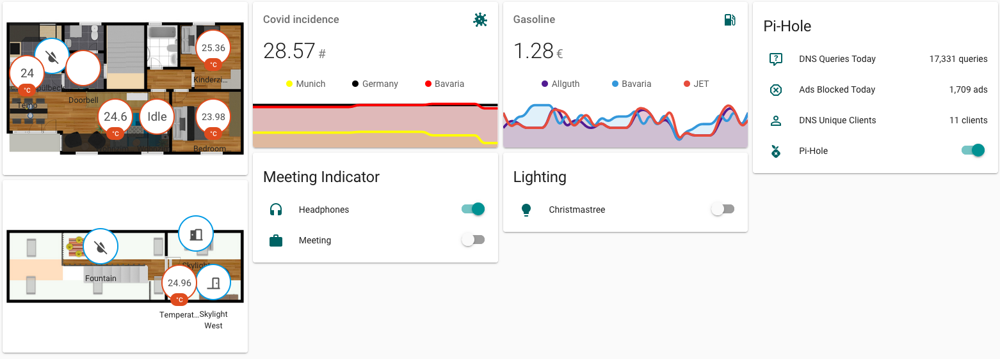

# Home Assistant (0.116.4) configuration
This is my [Home Assistant](https://home-assistant.io/) Core configuration.
Find custom configuration inside [packages](/packages) and associated [automations](/automations).

<a href="https://travis-ci.com/github/thebino/Home-AssistantConfig"></a>


The *map card* is a `picture-elements` with a custom map image created with [floorplanner.com](https://floorplanner.com)
```yaml
type: picture-elements
image: 'https://'
```

The *Covid card* is a `custom:mini-graph-card` with multiple sensors of my own [RKI Covid Integration](https://github.com/thebino/rki_covid)
```yaml
type: 'custom:mini-graph-card'
name: Covid incidence
icon: 'mdi:virus'
hours_to_show: 96
entities:
  - entity: sensor.sk_munchen_weekincidence
    name: Munich
    color: yellow
  - entity: sensor.deutschland_weekincidence
    name: Germany
    color: black
  - entity: sensor.bl_bayern_weekincidence
    name: Bavaria
    color: red
```

The *meeting indicator* is changing states on an external ESP32 with LEDs
```yaml
type: entities
entities:
  - entity: input_boolean.headphones
  - entity: input_boolean.meeting
title: Meeting Indicator
show_header_toggle: false
```

The *gasoline card* is observing different fuelling stations nearby with the [tankerkoenig integration](https://www.home-assistant.io/integrations/tankerkoenig/)
```yaml
type: 'custom:mini-graph-card'
name: Gasoline
icon: 'mdi:gas-station'
hours_to_show: 72
entities:
  - entity: sensor.tankerkoenig_allguth_gmbh_c_o_gabriele_schutz_e_k_diesel
    name: Allguth
  - entity: sensor.tankerkoenig_bavaria_petrol_diesel
    name: Bavaria
  - entity: sensor.tankerkoenig_jet_muenchen_limesstr_72_diesel
    name: JET
```
